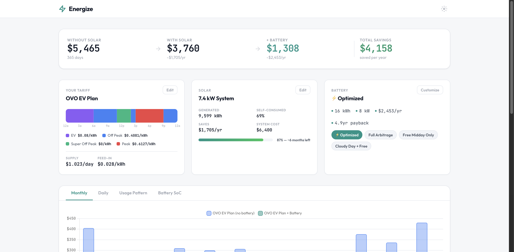
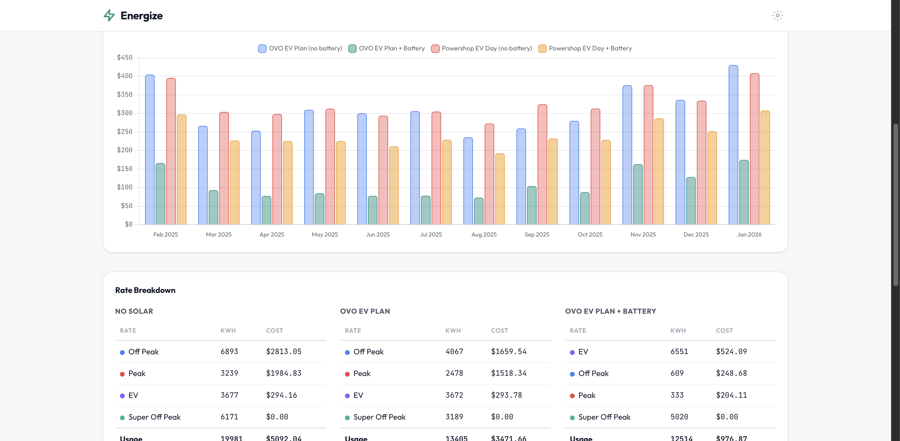
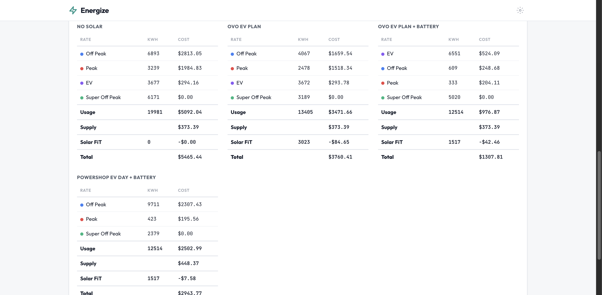

# ⚡ Energize

Compare electricity plan costs using real energy data. Includes tariff modelling, battery simulation, solar ROI tracking, and multi-plan comparison — all visualised in a results-first dashboard.



## Features

- **Real data** — pulls hourly energy data from IoTaWatt via InfluxDB (GridImport, SolarExport, SolarGeneration)
- **TOU tariff modelling** — flexible seasons, day-of-week schedules, and rate time blocks
- **Battery simulator** — rule-based charge/discharge strategies with degradation modelling
- **Solar ROI** — tracks generation, self-consumption, savings, and payback progress
- **IoTaWatt calibration** — static correction factors to align CT readings with your revenue meter
- **Plan comparison** — side-by-side cost analysis with 4-way monthly charts
- **Public holidays** — automatic Australian holiday detection via `date-holidays`

### Plan Comparison

Compare your current plan against alternatives with battery simulation applied to both:



### Rate Breakdown

Detailed cost breakdown across scenarios — No Solar, With Solar, Solar + Battery, and comparison plans:



## Pre-loaded Plans

| Plan | Peak | Off Peak | Free Window | EV Rate | Supply | FiT |
|---|---|---|---|---|---|---|
| **OVO EV Plan** | $0.6127 (3–9pm) | $0.4081 | $0.00 (11am–2pm) | $0.08 (12–6am) | $1.023/day | $0.028 |
| **Powershop EV Day** | $0.4620 (3–9pm) | $0.2376 | $0.00 (12–2pm) | — | $1.228/day | $0.005 |

## Battery Presets

| Strategy | Description |
|---|---|
| **Optimized** | Trickle charge 2kW 0–2am to 50% SoC + free midday 11–2pm + discharge 6–11am & 2pm–midnight |
| **Full Arbitrage** | Charge to 100% during EV rate + free window, discharge all other times |
| **Free Midday Only** | Only charge during free window, discharge rest of day |
| **Cloudy Day + Free** | Light overnight charge + free midday, conservative discharge |

## Quick Start

```bash
# Install dependencies
npm install

# Configure InfluxDB connection
cp .env.example .env
# Edit .env with your InfluxDB URL, org, token, and bucket

# Run
node server.js
```

Open [http://localhost:3000](http://localhost:3000)

## Environment Variables

| Variable | Description |
|---|---|
| `INFLUXDB_URL` | InfluxDB v2 URL |
| `INFLUXDB_ORG` | InfluxDB organization ID |
| `INFLUXDB_TOKEN` | InfluxDB API token |
| `INFLUXDB_BUCKET` | Bucket name (default: `iotawatt`) |
| `PORT` | Server port (default: `3000`) |

## Architecture

```
server.js              Express server, proxies InfluxDB queries
├── lib/
│   ├── influxdb.js    Flux queries, hourly aggregation, AEST timezone
│   └── holidays.js    Australian public holidays via date-holidays
└── public/
    ├── index.html     Results-first dashboard layout
    ├── css/styles.css  Light theme, responsive grid
    └── js/
        ├── api.js      Fetch wrapper for backend API
        ├── app.js      Dashboard controller, state management, drawers
        ├── battery.js  Battery simulator engine + strategy presets
        ├── calculator.js  Cost calculator, solar ROI, calibration
        ├── charts.js   Chart.js rendering (monthly, daily, hourly, SoC)
        └── tariff.js   Tariff data model, editor UI, plan definitions
```

## Deployment

Container image is built automatically via GitHub Actions and pushed to `ghcr.io/adampetrovic/energize`.

```bash
docker run -p 3000:3000 \
  -e INFLUXDB_URL=https://your-influxdb \
  -e INFLUXDB_ORG=your-org \
  -e INFLUXDB_TOKEN=your-token \
  -e INFLUXDB_BUCKET=iotawatt \
  ghcr.io/adampetrovic/energize:latest
```

### Kubernetes (Flux)

See the [home-ops deployment](https://github.com/adampetrovic/home-ops) for a Flux + app-template example in the `default` namespace.

## IoTaWatt Calibration

IoTaWatt CTs can read slightly different from your revenue meter. Energize includes calibration factors (adjustable in Settings) derived from comparing IoTaWatt hourly data against OVO smart meter CSV exports over 23 months:

| Measurement | Factor | Meaning |
|---|---|---|
| Import | × 0.9929 | IoTaWatt reads 0.7% high |
| Export | × 1.0144 | IoTaWatt reads 1.4% low |
| Solar | × 1.0037 | Average of import + export |

## License

MIT
